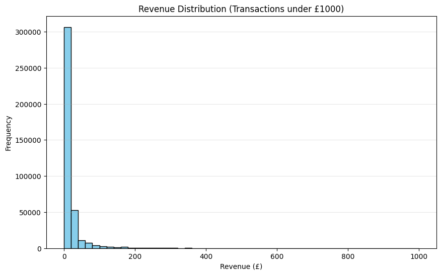
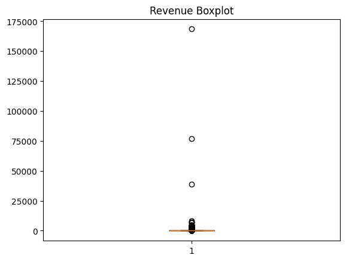

# Task 2: Statistical Exploratory Data Analysis (EDA) 📊

## 🎯 Project Objective
In this phase, I moved beyond standard business reporting to perform deep-dive statistical validation. The goal was to understand data distribution, isolate high-value anomalies, and quantify the relationship between purchase volume and total revenue.

---

## 🔬 Statistical Discovery & Methodology

### 1. Revenue Distribution (The Skew)
Analysis of the transaction data revealed a heavily right-skewed distribution. As shown in the histogram below, the vast majority of transactions fall under £100, though the tail extends significantly further.
* **Key Finding:** The gap between the Mean (£22.63) and Median (£12.39) indicates that average metrics are pulled upward by a small percentage of high-value orders.

### 2. Outlier Detection: The "Whale" Effect 🐋
Using a Boxplot, I identified several extreme outliers in the revenue data.
* **Observation:** Some individual transactions exceeded **£170,000**.
* **Insight:** These are not errors; they represent B2B bulk buyers. In retail analytics, these "Whales" are critical revenue drivers that require a different retention strategy than the average consumer.

### 3. Correlation: Quantity vs. Revenue
To understand what truly drives the bottom line, I analyzed the relationship between the number of items sold and the total revenue generated.
* **The "Secret Sauce":** There is a **0.91 Pearson Correlation** between Quantity and Revenue.
* **Insight:** As seen in the scatter plot, revenue scales almost perfectly with volume. This suggests the business is volume-driven rather than price-driven.

---

## 💡 Strategic Recommendations
- **Volume Incentives:** Since Quantity is the primary driver of Revenue ($r=0.91$), the business should focus on bundle deals to increase units per transaction.
- **B2B Focus:** The outliers identified in the Boxplot suggest a need for a specialized B2B sales channel.
- **Price Elasticity:** The weak correlation between Unit Price and total Revenue suggests customers are relatively inelastic—they buy based on volume needs rather than searching for the lowest price point.

---

## 🚀 Future Work
These statistical foundations—specifically the linear relationship identified in the scatter plot—provide the necessary validation to move into **Level 2: Predictive Modeling (Linear Regression)**.

---
[⬅️ Back to Main Project Page](../README.md)
